# 帮助文档

这是作者在大二JAVA程序设计上实现的一个实现自动化操作的javafx桌面小应用，主要的功能就是录制（listen）用户对电脑端的操作（鼠标和键盘的输入），并重新做（repeat）一遍，从而实现自动化操作的目的。

> 操作视频👇👇👇👇👇👇
>
> [【ListenAndRepeat】JAVAFX自动化执行小软件功能演示——录制用户鼠标键盘动作、批量执行_哔哩哔哩_bilibili](https://www.bilibili.com/video/BV1dG411P7iw/?vd_source=ee7084e0c5101ce0d8d076550c3bc93c)

## 快速开始

1. 点击👂（listen）按钮（窗口自动缩小）；
2. 用户操作（可以先试试创建一个文件输入一段内容、再关闭文件）；
3. 按esc退出（窗口自动复原）；
4. 点击✋（repeat）按钮（窗口自动缩小）；
5. 程序重复一遍用户的操作，执行完毕后窗口自动复原；

注意：在录制的时候，该应用不会录制鼠标运动轨迹的每一个坐标，只有当鼠标点击、松开、拖动，键盘按键、松开才会进行录制；

## 主要功能说明

### 总说明


其中每个窗体交互详细功能如下:

#### 窗体一：Listen, and repeat...


#### 窗体二：Repeat File by File



## 注意事项

- 无论是在软件监听还是在执行的时候都可以按esc键退出，所以对于含有esc的按键序列不会被录入，但用户可以在保存的txt文件需要的地方中手动加入

  ```
  4 (keyPress) 1 (Esc)
  ```

- 还有一个问题是开启执行时键盘控制速度功能时需要注意，程序模拟用户按下空格依然会导致程序停止，直到用户再次按下空格；

- 软件还有很多不完善的的地方，代码已经全部开源放到我的GitHub仓库中👇👇👇

[donglinkang2021/ListenAndRepeat: 这个项目是自己大二上学期期末阶段做的，主要做的是一个自动执行小工具 (github.com)](https://github.com/donglinkang2021/ListenAndRepeat)
